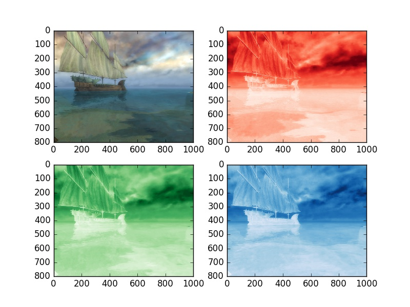

UECM3033 Assignment #2 Report
========================================================

- Prepared by: Kok Wen Jing
- Tutorial Group: T2

--------------------------------------------------------

## Task 1 --  $LU$ Factorization or SOR method

The reports, codes and supporting documents are to be uploaded to Github at: 

[https://github.com/wenjingkok/UECM3033_assign2](https://github.com/wenjingkok/UECM3033_assign2)

Explain your selection criteria here.

At first, we will check whether the matrix is strictly diagonally dominant matrix. If it is, it will be solve with LU factorization.
If the matrix is positive definite matrix then it will be solve by using SOR while if it is not, it will be solve using LU.

Explain how you implement your `task1.py` here.
The matrix will be checked and a suitable method to solve the problem is selected (LU or SOR) before solving the problem.

If LU factorization was selected, the lu function will be called.
When solving the linear systems using LU, we have two steps. Given Ax = b, A = LU and Y = Ux, where x is the unknown that we have to find out. 

First, we need to find A = LU using scipy.linalg.lu(A, True). The 'True' in the function indicate that no pivoting is perform when finding LU.

Then, we solve LY = b by finding the value for Y using scipy.linalg.solve(L, b)

The last step is finding x by solving Y = Ux using scipy.linalg.solve(U,Y)

For the SOR case, first we need to find the value of $\omega$ and initialize the first x value to be array of zero.
The matrix A can be written as A = D - L - U

$$\omega = \frac{2-\left [ 1-\sqrt{1-\left [ \rho \left ( K \right ) \right ]^{2}} \right ]}{\left [ \rho \left ( K \right ) \right ]^{2}} $$

where $$K  = D^{-1}\left(L+U\right)$$ and $$\rho \left ( K_ \right ) = \left | max\left ( \lambda _{i} \right ) \right |$$

Then we have, $$x^{\left ( k+1 \right )} = Q^{-1}\left ( Q - A \right )x^{\left ( k \right )} + Q^{-1}b$$

The calculation will continue until a maximum iteration is reached. In our case, we take maximum iteration to be 15.

---------------------------------------------------------

## Task 2 -- SVD method and image compression

Put here your picture file (Lenna.png)

RGB of image.jpg

How many non zero element in $\Sigma$?
There are N non zero element in $\Sigma$, where N is the size of $\Sigma$.
In image.jpg, there are 800 non zero element in $\Sigma$. 

Put here your lower and better resolution pictures. Explain how you generate
these pictures from `task2.py`.

Lower Resolution Picture 

Higher Resolution Picture

First, extract the RGB value from the image and find the U, $\Sigma$ and V value which is the SVD for each rgb color using scipy.linalg.svd.
For the lower resolution picture, we compute a new $\Sigma$ with the first 30 non zero elements from original $\Sigma$ while the other elements in $\Sigma$ is zeros.
Thus, we have new $\Sigma$ for every rgb color. 
In order to produce a new rgb values, we perform dot product for U, new $\Sigma$ and V for each rgb color.
Finally, we generate a new image using the array above and save the image.
The above steps are repeated for higher resolution picture but the new $\Sigma$ generated consists of first 200 elements from original $\Sigma$ while the other elements in new $\Sigma$ is zeros.

What is a sparse matrix?

A sparse matrix is a matrix in which most of the elements are zero.
In our case, the new $\Sigma$ generated is a (N x N) diagonal matrix instead of a (N x 1) matrix in original $\Sigma$.
The changes in the dimension for the new $\Sigma$ create a sparse matrix. Since only the diagonal of the new $\Sigma$ has a value, most of the element in the matrix is zero.

-----------------------------------

last modified: change your date here
